# KS0487 Keyestudio 37 in 1 Sensor Kit v3.0


## 1.Introduction

This is an era of artificial intelligence. Artificial intelligence is widely
applied to our lives, especially for all kinds of robots. In the first place we
need to learn the basic working principle.

The microcontroller is equivalent to the brain of the robot. The various sensors
installed on robots are their eyes, noses, mouths, ears and so on. To make
beginners understand principle readily, Keyestudio has released this sensor kit,
including digital and analog sensors, modules such as ultrasound, digital tubes,
temperature and humidity sensor. In addition, we provide detailed connection
diagram and sample code for each module.

All sample codes are based on ARDUINO. Also, you have other alternatives
development platforms such as 51, STM32, Raspberry Pi and micro:bit, as the
working principle of those platforms is almost same.

Note: the port “-, +, S” on sensors or modules correspond to “G, V, S” due to
the change of edition.

**Tutorial and code download address：[KS0487 Tutorial](https://fs.keyestudio.com/KS0487)**


## 2.Component List 

| White Led                                                    |       |
|--------------------------------------------------------------|------------------------------------------------------|
| Traffic Light                                                |       |
| RGB LED                                                      |       |
| 4-digit LED digital tube                                     |      |
| Active Buzzer                                                |       |
| Passive Buzzer                                               |       |
| Motor Module                                                 |       |
| Button Module                                                |       |
| Capacitive Touch                                             |      |
| Knock Sensor                                                 | 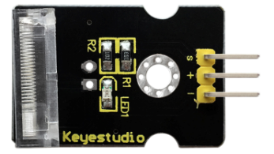      |
| Digital Tilt Sensor                                          | 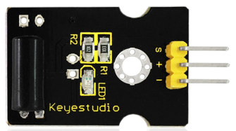      |
| Photo Interrupter                                            |       |
| Reed Switch                                                  |       |
| Hall Sensor                                                  |       |
| Collision Sensor                                             |       |
| Line Tracking Sensor                                         |       |
| Infrared Obstacle Avoidance                                  |       |
| Photocell                                                    |       |
| Analog Temperature                                           |       |
| Analog Rotation                                              |       |
| Analog Sound                                                 |       |
| Flame Alarm                                                  |       |
| Water Level                                                  |       |
| Soil Moisture                                                |       |
| Steam Moisture                                               |       |
| Analog Ceramic Vibration                                     |       |
| Voltage Detection                                            | 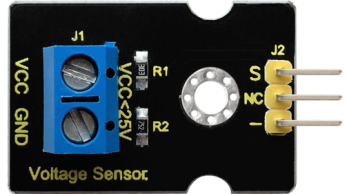      |
| Digital IR Receiver                                          |       |
| Digital IR transmitter                                       |       |
| Joystick                                                     |       |
| Single Relay                                                 |       |
| Rotary Encoder                                               |      |
| Pulse Rate Monitor                                           |       |
| Linear Temperature                                           |       |
| Temperature and Humidity Display                             |       |
| Ultrasound Sensor                                            |       |
| PIR Motion Sensor                                            |       |

## 3.Project

Project 1: White LED 


Description:  
This white LED light module is ideal for Arduino starters. It can be easily connected to IO/Sensor shield. It enables interaction with light-related works.  

Note: You can choose other LED modules to emit different color like yellow, red, green and blue.  

Specification:  
White LED module  
Type: Digital  
PH2.54 socket  
Size: 30X20mm  
Weight: 3g  

Connection Diagram:   
First, you need to prepare the following parts before connection:  
UNO board\*1   
White LED module \*1     
USB Cable\*1   
Jumper wire\*3   

Connect the S pin of module to Digital 3 of UNO board, connect the negative pin to GND port, positive pin to 5V port.  

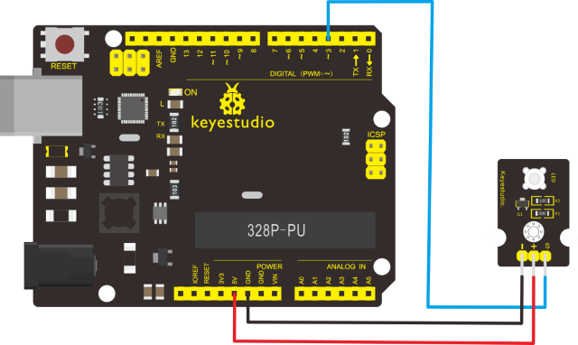  

Sample Code:   
Copy and paste the below code to Arduino software.  
```c++
int led = 3;
void setup()
{
    pinMode(led, OUTPUT);
    //Set Pin3 as output
}
void loop()
{
    digitalWrite(led, HIGH);   //Turn on led
    delay(2000);
    digitalWrite(led, LOW);    //Turn off led
    delay(2000);
}
```
Example Result  
Done wiring and powered up, upload well the code, you will see the LED module emit the white light.    

[](https://wiki.keyestudio.com/File:KS0349_1-1.png)    
  
Project 2: RGB LED  
  
  
    

**Description：**    
This is a full-color LED module, which contains 3 basic colors－red, green and blue. They can be seen as separate LED lights. After programming, you can turn them on and off by sequence or can also use PWM analog output to mix three colors to generate different colors.    

Specification：  
Color: red, green and blue  
Brightness: High  
Voltage: 5V  
Input: digital level  
Size: 30\*20mm  
Weight: 3g  

Connection Diagram：    
First, you need to prepare the following parts before connection:    
UNO Board\*1    
RGB LED module \*1    
USB Cable\*1    
Jumper Wire\*4  

Connect the V pin of module to 5V port of UNO board, connect the B pin to Digital 9, R pin to Digital 10, G pin to Digital 11.    

[](https://wiki.keyestudio.com/File:0032.jpg)  

Sample Code：  
Copy and paste the below code to Arduino software.  

```c++
int redpin = 11;    //select the pin for the red LED
int bluepin = 10;   // select the pin for the blue LED
int greenpin = 9;   // select the pin for the green LED
int val;
void setup() {
    pinMode(redpin, OUTPUT);
    pinMode(bluepin, OUTPUT);
    pinMode(greenpin, OUTPUT);
}
void loop()
{ for (val = 255; val > 0; val--)
    { analogWrite(11, val);
    analogWrite(10, 255 - val);
    analogWrite(9, 128 - val);
    delay(1);
    }
    for (val = 0; val < 255; val++)
    { analogWrite(11, val);
    analogWrite(10, 255 - val);
    analogWrite(9, 128 - val);
    delay(1);
    }
}
```
Example Result  
Done wiring and powered up,upload well the code, you will see the RGB LED module emit shiny colors.  
[](https://wiki.keyestudio.com/File:KS0349_2-2.png)  


Project 3: Traffic Light

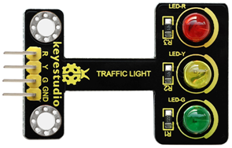  

Description:   
When learning the microcontroller, you may usually use three LEDs, namely red, green and yellow lights to simulate the traffic light blinking via external connection.    
This time we specially design this module which is very convenient for wiring, and on the module you can see the red, yellow and green LED. This module is fully compatible with Arduino microcontroller and Raspberry Pi system.  

Specification:  
Working Voltage: 3.3-5v  
Interface Type: digital  
PH2.54 Socket  

Connection Diagram:  
First, you need to prepare the following parts before connection: 
UNO Board\*1    
Traffic light module \*1    
USB Cable\*1      
Jumper Wire\*4    

Connect the R pin of module to Digital 5 of UNO board, connect the Y pin to Digital 4, G pin to Digital 3, GND pin to ground port.    

[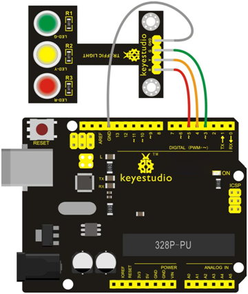](https://wiki.keyestudio.com/File:KS0349_4-2.png)    

Sample Code:      
Copy and paste the below code to Arduino software.    
```c++
int redled = 5;    // initialize digital pin 5.
int yellowled = 4; // initialize digital pin 4.
int greenled = 3;  // initialize digital pin 3.
void setup()
{
    pinMode(redled, OUTPUT);    // set the pin with red LED as “output”
    pinMode(yellowled, OUTPUT); // set the pin with yellow LED as “output”
    pinMode(greenled, OUTPUT);  // set the pin with green LED as “output”
}
void loop()
{
    digitalWrite(greenled, HIGH);  // turn on green LED
    delay(5000);                   // wait 5 seconds
    digitalWrite(greenled, LOW);   // turn off green LED
    for (int i = 0; i < 3; i++)    // blinks for 3 times
    {
    delay(500);                    // wait 0.5 seconds
    digitalWrite(yellowled, HIGH); // turn on yellow LED
    delay(500);                    // wait 0.5 seconds
    digitalWrite(yellowled, LOW);  // turn off yellow LED
    }
    delay(500);                    // wait 0.5 seconds
    digitalWrite(redled, HIGH);    // turn on red LED
    delay(5000);                   // wait 5 seconds
    digitalWrite(redled, LOW);     // turn off red LED
}
```
Example Result:  
Done uploading the code, powered up, three LEDs on the module will automatically simulate the traffic light on and off, circularly.    
[](https://wiki.keyestudio.com/File:KS0349_4-3.png)  


Project 4: Buzzer Beeping

[](https://wiki.keyestudio.com/File:KS0349_5-1.png)  

Introduction:  
Here is the simplest sound making module. You can use high/low level to drive it. Changing the frequency it buzzes can produce different sounds. This module is widely used on our daily appliances like PC, refrigerator, phones, etc. In addition, you can create many interesting interactive projects with this small but useful module.Just try it!! You will find the electronic sound it creates so fascinating.    

Specification:  
Working voltage: 3.3-5v  
Interface type: digital  
Size: 30\*20mm  
Weight: 4g  

Connection Diagram:    
First, you need to prepare the following parts before connection:  
UNO Board\*1  
Active buzzer module \*1   
USB Cable\*1   
Jumper Wire\*3  

Connect the S pin of module to Digital 3 of UNO board, connect the negative pin to GND port, positive pin to 5V port.    

[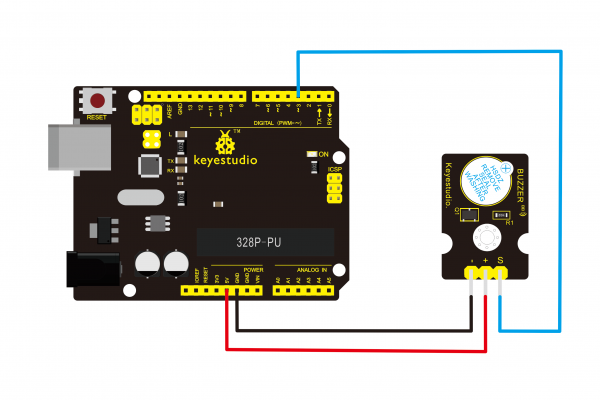](https://wiki.keyestudio.com/File:Ks0018-.png)  

Sample Code:    
Copy and paste the below code to Arduino software.  

```c++
int buzzPin = 3;
//Connect Buzzer on Digital Pin3
void setup()
{
    pinMode(buzzPin, OUTPUT);
}
void loop()
{
    digitalWrite(buzzPin, HIGH);
    delay(1);
    digitalWrite(buzzPin, LOW);
    delay(1);
}
```
Example Result:  
Done uploading the code to board, the buzzer will make a sound.  
[](https://wiki.keyestudio.com/File:KS0349_5-2.png)  


Project 5: Passive Buzzer

[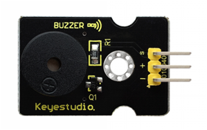](https://wiki.keyestudio.com/File:KS0349_6-1.png)  

Introduction:  
We can use Arduino to make many interactive works of which the most commonly used is acoustic-optic display. The circuit in this experiment can produce sound. Normally, the experiment can be done with a buzzer or a speaker, while buzzer is simpler and easier to use. The buzzer we introduced here is a passive buzzer. It cannot be actuated by itself, but by external pulse frequencies.  
  
Different frequencies produce different sounds. You can use Arduino to code the melody of a song, quite fun and simple.    

Specification:  
Working voltage: 3.3-5v  
Interface type: digital  
Size: 30\*20mm  
Weight: 4g  

Connection Diagram:  
First, you need to prepare the following parts before connection: 
UNO Board\*1  
Passive buzzer module \*1  
USB Cable\*1  
Jumper Wire\*3  

Connect the S pin of module to Digital 3 of UNO board, connect the negative pin  to GND port, positive pin to 5V port.  

[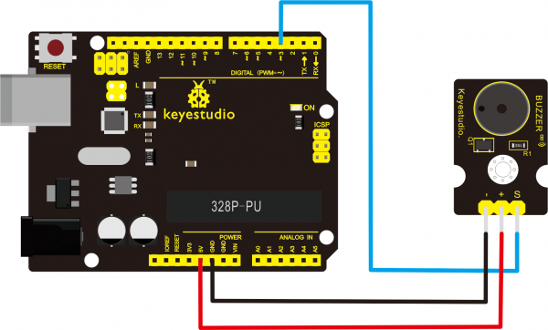](https://wiki.keyestudio.com/File:0019.png)  

Sample Code:  
Copy and paste the below code to Arduino software.

```c++
int buzzer = 3;              //set digital IO pin of the buzzer
void setup()
{
    pinMode(buzzer, OUTPUT); // set digital IO pin pattern, OUTPUT to be output
}
void loop()
{ unsigned char i, j;        //define variable
    while (1)
    { for (i = 0; i < 80; i++)      // output a frequency sound
    { digitalWrite(buzzer, HIGH);   // sound
        delay(1);                   //delay1ms
        digitalWrite(buzzer, LOW);  //not sound
        delay(1);                   //ms delay
    }
    for (i = 0; i < 100; i++)       // output a frequency sound
    {
        digitalWrite(buzzer, HIGH); // sound
        digitalWrite(buzzer, LOW);  //not sound
        delay(2);                   //2ms delay
    }
    }
}
```
Example Result:  
Done uploading the code to board, the buzzer will make a sound.  

[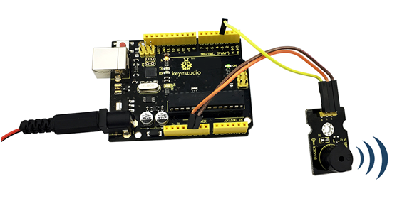](https://wiki.keyestudio.com/File:KS0349_6-2.png)  


Project 6: Motor Module

Introduction:    
The keyestudio vibration motor module facilitates the conversion of electrical signals to mechanical vibration. It mainly uses a high quality, high standard vibration motor. We can directly control the motor vibration using the digital pin of Arduino microcontroller - HIGH level for triggering; LOW for breaking. Or control the vibration intensity of the motor by Arduino PWM pins. This module is suitable for the vibration-sensitive interactive creations, wearable smart device and so on. The module comes with a 3mm fixing hole, easy to fix it to other devices.  

Features:  
Operating voltage: DC 5V  
Operating current: 35mA  
Max power: 0.5W  
Operating temperature range: -25℃ to 65℃  
Interface: 3pin of 2.54mm pitch  
Fixed hole diameter: 3mm  
Dimensions: 34mm\*19mm\*6mm  
Weight: 3.2g  

Connection Diagram:    
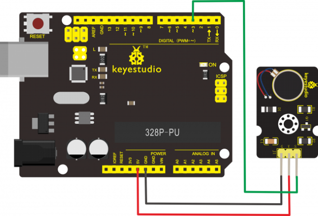  

Test Code:

```c++
#define ZD 3
void setup() {
    // put your setup code here, to run once:
    pinMode(ZD, OUTPUT);
}
void loop() {
    // put your main code here, to run repeatedly:
    analogWrite(ZD, 200);
    delay(5000);
    analogWrite(ZD, 0);
    delay(1000);
    analogWrite(ZD, 100);
    delay(5000);
    analogWrite(ZD, 0);
    delay(1000);
}

```
Result
Done uploading the code, the vibration motor on the keyestudio module will first strongly vibrate for 5 seconds, stop for 1 second, and weakly vibrate for 5 seconds, then stop for 1 second, alternately and circularly.  

[](https://wiki.keyestudio.com/File:0450图片1.png)


Project 7: Digital Push Button

  

**Introduction:**  
This is a basic button module. You can simply plug it into an IO shield to have your first try of Arduino.    

Features:  
Wide voltage range from 3.3V to 5V  
Easily recognizable interfaces of sensors ("A" for Analog and "D" for Digital)  
Standard assembled hole  
Clear icons illustration  
High quality connector  
Easy to plug and operate  
Large button and high-quality cap  
To achieve interesting and interactive works  

Specification:  
Supply Voltage: 3.3V to 5V  
Interface: Digital  
Size: 30\*20mm  
Weight: 4g  

Connection Diagram:    
First, you need to prepare the following parts before connection:  
UNO Board\*1    
Push button module \*1    
USB Cable\*1   
Jumper Wire\*3  

Connect the S pin of module to Digital 3 of UNO board, connect the negative pin to GND port, positive pin to 5V port.  

[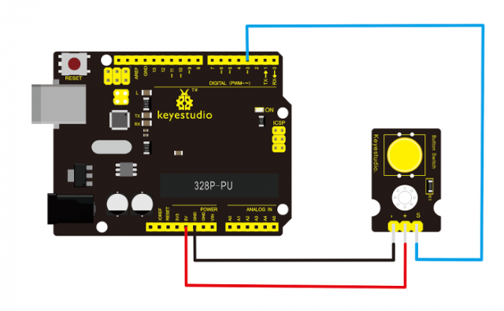](https://wiki.keyestudio.com/File:Ks0029.png)  

Sample Code:    
Copy and paste the below code to Arduino software.  

```c++
/* # When you push the digital button, the Led 13 on the board will be turned on. Otherwise,the led is turned
    off.
*/
int ledPin = 13;
// choose the pin for the LED
int inputPin = 3;
// Connect sensor to input pin 3
void setup() {
    pinMode(ledPin, OUTPUT);
    // set LED as output
    pinMode(inputPin, INPUT);
    // set pushbutton as input
}
void loop() {
    int val = digitalRead(inputPin);
    // read input value
    if (val == HIGH) {
    // check if the input is HIGH
    digitalWrite(ledPin, LOW);
    // turn LED OFF
    } else {
    digitalWrite(ledPin, HIGH); // turn LED ON
    }
}
```
Example Result:   
Wire it up well as the figure shown below, and then upload the code to the board.  
[](https://wiki.keyestudio.com/File:KS0349_7-2.png)   

When you push the digital button, the Led 13 on UNO board will be on. When release the button,the led is off. Shown as below.    
[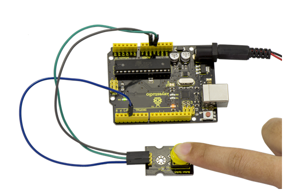](https://wiki.keyestudio.com/File:KS0349_7-3.png)  


Project 8: Collision Flash  

[](https://wiki.keyestudio.com/File:KS0349_8-1.png)  

Description:    
Crash sensor, also known as electronic switch, is a digital on-off input module necessary for elementary electronic learning. By programming, it can realize to control over light, sound device, key choice function of LCD display, etc. Using 3P sensor cable to connect it to sensor shield, it can be installed to 4WD AL alloy mobile robot platform to realize collision detection function. It is both convenient and efficient.    

Note:You can make a collision flasher using collision module and built-in LED on interface 13. Connect the collision sensor to pin 3. When the collision sensor senses a collision signal, the LEDs on both mainboard and module will light up simultaneously.  

Parameters:

If collision happens upfront of where collision module is installed, module outputs low level signal; no collision, outputs high level signal.  

Module reserves M3 mounting hole, convenient for fixation on a car.  

Module size: 3.1cm \* 2.1cm  

With switch indicator light, if there is collision, light is on; no collision, light is off.  

Pin definition:  
1. Positive pin (+): connect to 3v-12v power supply   
2. Negative pin (-): connect to GND    
3. Signal pin (S): connect to High-low level output  

Connection Diagram:  
First, you need to prepare the following parts before connection:  
UNO Board\*1   
Crash module \*1  
USB Cable\*1   
Jumper Wire\*3  

Connect the S pin of module to Digital 3 of UNO board, connect the negative pin to GND port, positive pin to 5V port.    

[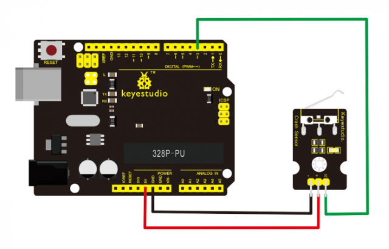](https://wiki.keyestudio.com/File:Ks0021.png)  

Sample Code:  
Copy and paste the below code to Arduino software.  
```c++
int Led = 13;  // set pin for LED
int Shock = 3; // set pin for collision sensor
int val;       // set digital variable val
void setup()
{
    pinMode(Led, OUTPUT);     // set pin LED as output
    pinMode(Shock, INPUT);    // set collision sensor as input
}
void loop()
{
    val = digitalRead(Shock); // read value on pin 3 and assign it to val
    if (val == HIGH)          // when collision sensor detects a signal, LED turns on.
    {
    digitalWrite(Led, LOW);
    } 
    else
    {
    digitalWrite(Led, HIGH);
    }
}
```
Example Result:  
Wire it up well and then upload the code to the board.  
[](https://wiki.keyestudio.com/File:KS0349_8-3.png)  

When the object crashes the switch of sensor, both the led on the sensor and led 13 on the board are turned on.   
[](https://wiki.keyestudio.com/File:KS0349_8-4.png)  


Project 9: Line Tracking

[](https://wiki.keyestudio.com/File:KS0349_9-1.png)  

Introduction:  
This Line Tracking Sensor can detect white line in black or black line in white. The single line-tracking signal provides a stable output signal TTL for a more accurate and more stable line. Multi-channel option can be easily achieved by installing required line-tracking robot sensors.  

Specification:   
Power supply: +5V   
Operating current: \< 10mA  
Operating temperature range: 0°C \~ + 50°C  
Output Level: TTL level  
Size: 41.7\*10.7mm   
Weight: 3g  

Connection Diagram:    
First, you need to prepare the following parts before connection:   
UNO Board\*1  
Line tracking module \*1  
USB Cable\*1  
Jumper Wire\*3  

Connect the S pin of module to Digital 3 of UNO board, connect the GND pin to GND port, V+ pin to 5V port.   
[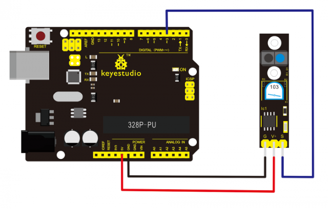](https://wiki.keyestudio.com/File:Ks0050-1.png)  

Sample Code:  
Copy and paste the below code to Arduino software.    
```c++
//Arduino Sample Code
void setup()
{
    Serial.begin(9600);
}
void loop()
{
    Serial.println(digitalRead(3)); // print the data from the sensor
    delay(500);
}
```
Example Result:  
Done uploading the code to board, open the serial monitor and set the baud rate as 9600, then you can see the data from the sensor. Shown below.    
[](https://wiki.keyestudio.com/File:KS0349_9-2.png)  


Project 10: Infrared Obstacle Avoidance

[](https://wiki.keyestudio.com/File:KS0349_10-1.png)  

Introduction:  
Infrared obstacle detector sensor is equipped with distance adjustment function and is especially designed for wheeled robots. This sensor has strong adaptability to ambient light and is of high precision. It has a pair of infrared transmitting and receiving tube. When infrared ray launched by the transmitter tube encounters an obstacle (its reflector), the infrared ray will be reflected to the receiver tube, thus the indicator will light up, and signal output interface outputs digital signal. In addition, you can rotate the potentiometer knob to adjust detection distance ( effective distance: 2～40cm, working Voltage: 3.3V-5V ). Thanks to a wide voltage range, this sensor can work steadily even under fluctuating power supply voltage and is suitable for the use of various micro-controllers, Arduino controllers and BS2 controllers. A robot mounted with this sensor can sense obstaclein the environment.  

Specification:  
Working voltage: DC 3.3V-5V  
Working current: ≥20mA  
Working temperature: －10℃—＋50℃  
Detection distance: 2-40cm  
IO Interface: 4 wire interface (-/+/S/EN)  
Output signal: TTL voltage  
Accommodation mode: Multi-circle resistance regulation  
Effective Angle: 35°  
Size: 41.7\*16.7mm  
Weight: 5g  

Connection Diagram:   
First, you need to prepare the following parts before connection:  
UNO Board\*1  
Obstacle detector module \*1  
USB Cable\*1  
Jumper Wire\*3  

Connect the Out pin of module to Digital 3 of UNO board, connect the V+ pin to 5V port, GND pin to GND port.  

[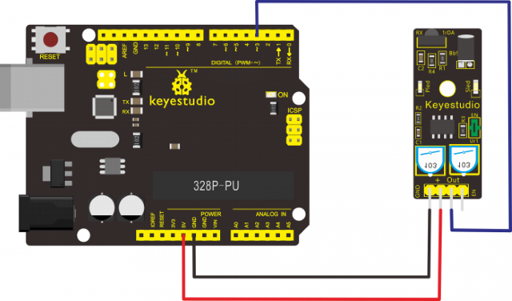](https://wiki.keyestudio.com/File:0051.png)  

Sample Code:   
Copy and paste the below code to Arduino software.  
```c++
const int sensorPin = 3;// the number of the sensor pin
const int ledPin = 13;// the number of the LED pin
int sensorState = 0;// variable for reading the sensor status
void setup() {
    pinMode(ledPin, OUTPUT);
    pinMode(sensorPin, INPUT);
}
void loop() {
    // read the state of the sensor value:
    sensorState = digitalRead(sensorPin);
    // if it is, the sensorState is HIGH:
    if (sensorState == HIGH) {
    digitalWrite(ledPin, HIGH);
    }
    else {
    digitalWrite(ledPin, LOW);
    }
}
```
Example Result:  
Done uploading the code to board, you can see the led on both UNO board and obstacle detector sensor is turned on.  
[](https://wiki.keyestudio.com/File:KS0349_10-2.png)  

If we put a foam block in front of the sensor, this time when sensor detects the obstacle, sled on the sensor will be turned on.   
[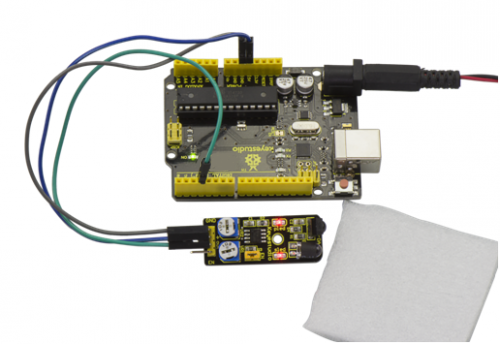](https://wiki.keyestudio.com/File:KS0349_10-3.png)  


Project 11: Photo Interrupter

[](https://wiki.keyestudio.com/File:KS0349_11-1.png)  

Introduction:  
Upright part of this sensor is an infrared emitter and on the other side, it’s a shielded infrared detector. By emitting a beam of infrared light from one end to other end, the sensor can detect an object when an object passes through the beam. It is used for many applications including optical limit switches, pellet dispensing, general object detection, etc.  

Specification:  
Supply Voltage: 3.3V to 5V  
Interface: Digital  
Size: 30\*20mm  
Weight: 3g  

Connection Diagram:    
First, you need to prepare the following parts before connection:  
UNO Board\*1    
Photo interrupter module \*1  
USB Cable\*1  
Jumper Wire\*3  

Connect the S pin of module to Digital 3 of UNO board, connect the negative pin to GND port, positive pin to 5V port.  

[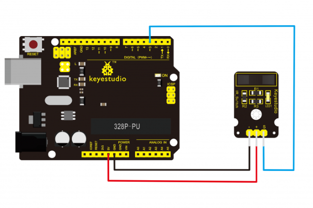](https://wiki.keyestudio.com/File:Ks0009.png)

Sample Code:  
Copy and paste the below code to Arduino software.
```
int Led = 13 ;       // define LED Interface
int buttonpin = 3;   // define the photo interrupter sensor interface
int val ;            // define numeric variables val
void setup ()
{
    pinMode (Led, OUTPUT) ;         // define LED as output interface
    pinMode (buttonpin, INPUT) ;    // define the photo interrupter sensor output interface
}
void loop ()
{
    val = digitalRead (buttonpin) ; // digital interface will be assigned a value of 3 to read val
    if (val == HIGH)                // When the light sensor detects a signal is interrupted, LED flashes
    {
    digitalWrite (Led, HIGH);
    }
    else
    {
    digitalWrite (Led, LOW);
    }
}
```
Example Result:  
Done uploading the code to board, you can see both led on UNO board and on module are turned on. Shown as below.  
[](https://wiki.keyestudio.com/File:KS0349_11-2.png)  

When pick up a paper on groove joint of module, the signal is interrupted, and led1 on the module will be turned off. Shown as below.    
[](https://wiki.keyestudio.com/File:KS0349_11-3.png)  


Project 12: Hall Magnetic

[](https://wiki.keyestudio.com/File:KS0349_12-1.png)

Introduction:  
This is a magnetic induction sensor. It can sense the magnetic materials within a detection range up to 3cm. The detection range and the strength of magnetic field areproportional. The output is digital on/off. This sensor uses the SFE Reed Switch - Magnetic Field Sensor.  

Specification:
Sensing magnetic materials  
Detection range: up to 3cm  
Output: digital on/off  
Size: 30\*20mm  
Weight: 3g  

Connection Diagram:  
First, you need to prepare the following parts before connection:  
UNO Board\*1    
Hall sensor \*1    
USB Cable\*1    
Jumper Wire\*3  

Connect the S pin of module to Digital 3 of UNO board, connect the negative pin to GND port, positive pin to 5V port.  

[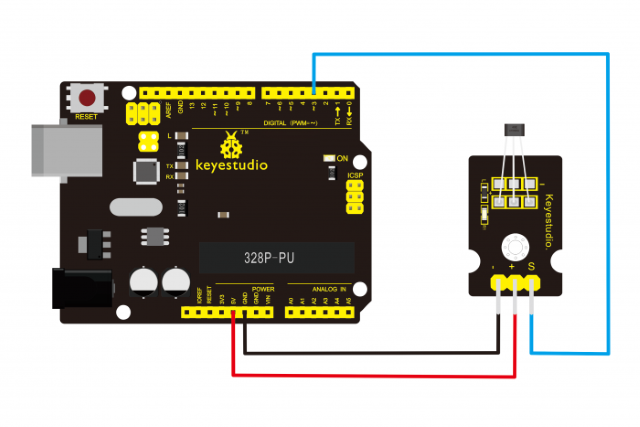](https://wiki.keyestudio.com/File:Ks0020.png)  

Sample Code:  
Copy and paste the below code to Arduino software.  
```
int ledPin = 13;    // choose the pin for the LED
int inputPin = 3;   // Connect sensor to input pin 3
int val = 0;        // variable for reading the pin status
void setup() {
    pinMode(ledPin, OUTPUT);      // declare LED as output
    pinMode(inputPin, INPUT);     // declare pushbutton as input
}
void loop() {
    val = digitalRead(inputPin);  // read input value
    if (val == HIGH) {            // check if the input is HIGH
    digitalWrite(ledPin, LOW);    // turn LED OFF
    } else {
    digitalWrite(ledPin, HIGH);   // turn LED ON
    }
}
```
Example Result:  
Wire it up and upload well the code to board, you will see that D13 indicator on UNO board is off, and led on the module is also off.  
[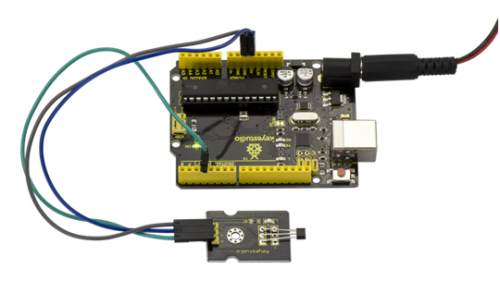](https://wiki.keyestudio.com/File:KS0349_12-2.png)  

But if put a magnetic ball close to the hall module, you will see the D13 indicator on UNO board is turned on, and led on the module is also turned on.      
[](https://wiki.keyestudio.com/File:KS0349_12-3.png)  


Project 13: Knock Sensor

[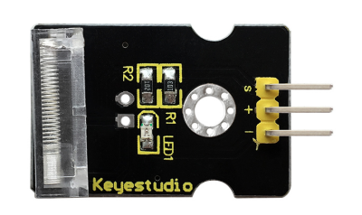](https://wiki.keyestudio.com/File:KS0024_knock_sensor.png)  

Description:   
This module is a knock sensor. When you knock it, it can send a momentary signal. You can combine it with Arduino to make some interesting experiments e.g. electronic drum.

Specification:  
Working voltage: 5V  
Size: 30\*20mm  
Weight: 3g  

Connection Diagram:  
First, you need to prepare the following parts before connection:  
UNO Board\*1    
Knock sensor \*1    
USB Cable\*1    
Jumper Wire\*3  

Connect the S pin of module to Digital 3 of UNO board, connect the negative pin to GND port, positive pin to 5V port.  

[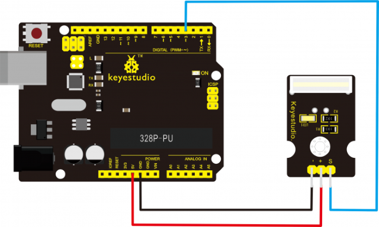](https://wiki.keyestudio.com/File:Ks0024-.png)  

Sample Code:    
Copy and paste the below code to Arduino software.  
```c++
const int interruptA = 1;  // Interrupter 1 is at digital 3
int LED = 13;              // define digital 13
void setup()
{
    attachInterrupt(interruptA, StateChanged, FALLING);  // when high level becomes low level at digital 3, trigger interrupt
    pinMode(LED, OUTPUT);                                //set LED to output
}
void loop()
{
    digitalWrite(LED, LOW);  //LED gets dim
    delay(1000);             //delay in 1s
}
void StateChanged()          //When high level becomes low level at digital 3
{
    digitalWrite(LED, HIGH); //LED is on
    delay(2000);             //Delay in 2s
}
```
Example Result:

Burn the test code, wire up, and plug in power. When you knock sensor, D13 of control board is turned on 2s.    
[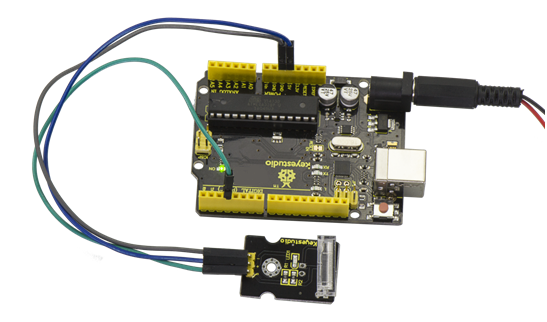](https://wiki.keyestudio.com/File:KS0349_13-2.png)  


Project 14: Digital Tilt Sensor

[](https://wiki.keyestudio.com/File:KS0349_14-1.png)  

Introduction:    
Tilt Sensor is a digital tilt switch. It can be used as a simple tilt switch. Simply plug it to our IO/Sensor shield, easy for wire connection. With dedicated sensor shield and Arduino, you can make lots of interesting and interactive works.  

Specification:  
Supply Voltage: 3.3V to 5V  
Interface: Digital  
Size: 30\*20mm  
Weight: 3g  

Connection Diagram:     
Connect the S pin of module to Digital 3 of UNO board, connect the negative pin to GND port, positive pin to 5V port.    
[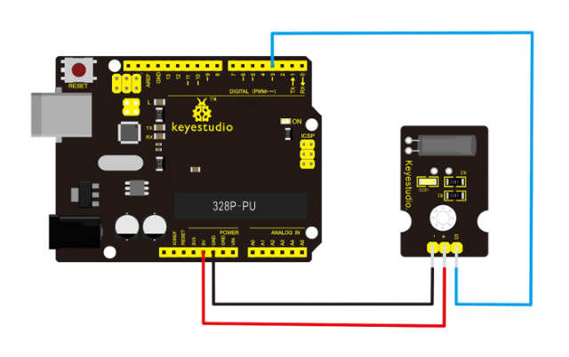](https://wiki.keyestudio.com/File:Ks0025.png)  

Sample Code:    
Copy and paste the below code to Arduino software.  
```c++
int ledPin = 13;   // Connect LED to pin 13
int switcher = 3;  // Connect Tilt sensor to Pin3
void setup()
{
    pinMode(ledPin, OUTPUT);  // Set digital pin 13 to output mode
    pinMode(switcher, INPUT); // Set digital pin 3 to input mode
}
void loop()
{
    if (digitalRead(switcher) == HIGH) //Read sensor value
    {
    digitalWrite(ledPin, HIGH);        // Turn on LED when the sensor is tilted
    }
    else
    {
    digitalWrite(ledPin, LOW);         // Turn off LED when the sensor is not triggered
    }
}
```
Example Result:  
Done wiring and powered up, then upload well the code to UNO board.  
[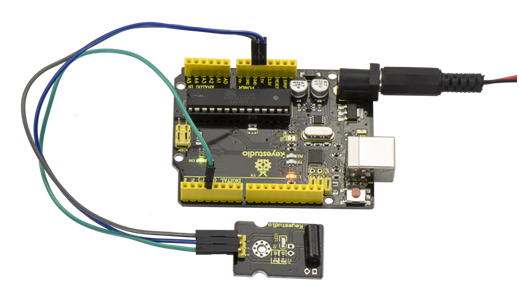](https://wiki.keyestudio.com/File:KS0349_14-2.png)  

Then tilt the sensor, you will see the led on the sensor is turned on. Shown as below.    
[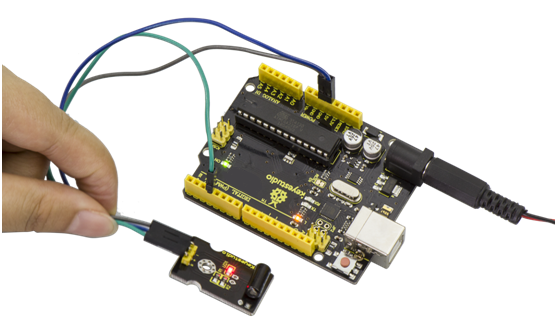](https://wiki.keyestudio.com/File:KS0349_14-3.png)    


Project 15: Capacitive Touch

****  

Description:  
Are you tired of clicking mechanic buttons? Well, try our capacitive touch sensor. You can find touch sensors mostly used on electronic device. So upgrade your Arduino project with this touch sensor to make it more cool. This little sensor can sense the touch of body and metal with feedback of a high/low voltage level. Even isolated by some cloth and papers, it can still feel the touch. But its sensitivity will decrease as isolation layer gets thicker. We will make further improvement on those sensor modules to give youbetter experience.    

Specification:  
Supply Voltage: 3.3V to 5V  
Interface: Digital  
Size: 30\*20mm  
Weight: 3g  

Connection Diagram:  
First, you need to prepare the following parts before connection:  
UNO Board\*1    
Capacitive touch sensor \*1    
USB Cable\*1    
Jumper Wire\*3    

Connect the S pin of module to Digital 2 of UNO board, connect the negative pin to GND port, positive pin to 5V port.  

[](https://wiki.keyestudio.com/File:Ks0031-1.png)  

Sample Code:   
Copy and paste the below code to Arduino software.  
```c++
int ledPin = 13;            // Connect LED on pin 13, or use the onboard one
int KEY = 2;                // Connect Touch sensor on Digital Pin 2
void setup() {
    pinMode(ledPin, OUTPUT);// Set ledPin to output mode
    pinMode(KEY, INPUT);    //Set touch sensor pin to input mode
}
void loop() {
    if (digitalRead(KEY) == HIGH) { //Read Touch sensor signal
    digitalWrite(ledPin, HIGH);     // if Touch sensor is HIGH, then turn on
    }
    else {
    digitalWrite(ledPin, LOW);      // if Touch sensor is LOW, then turn off the led
    }
}
```
Example Result:  
Done wiring and powered up, upload well the code, then touch the sensor with your finger, both D2 led on the sensor and D13 indicator on UNO board are on. Otherwise, those two indicators are turned off.   
[](https://wiki.keyestudio.com/File:Ks0031-2.png)  


Project 16: Flame Alarm  

[](https://wiki.keyestudio.com/File:KS0349_16-1.png)  

Description:  
This flame sensor can be used to detect fire or other lights with wavelength stands at 760 nm \~ 1100 nm. In the fire-fighting robot game, the flame plays an important role in the probing, which can be used as the robot's eyes to find fire source.  

Specification:
Supply Voltage: 3.3V to 5V  
Detection range: 20cm (4.8V) \~ 100cm (1V)  
Rang of Spectral Bandwidth: 760nm to 1100nm  
Operating temperature: -25℃to 85℃  
Interface: digital  
Size: 44\*16.7mm  
Weight: 4g  

Connection Diagram:  
First, you need to prepare the following parts before connection:  
UNO Board\*1  
Flame sensor \*1  
USB Cable\*1  
Jumper Wire\*3  

Connect the D0 pin of module to Digital 2 of UNO board, connect the GND pin to GND port, VCC pin to 5V port.  
[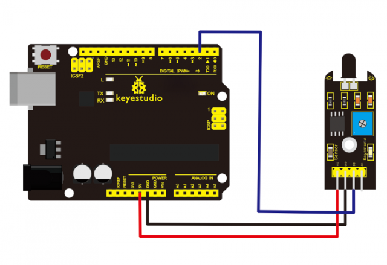](https://wiki.keyestudio.com/File:Ks0036-1.png)  

Sample Code:  
Copy and paste the below code to Arduino software.  
```c++
const int flamePin = 2; // the number of the flame pin
const int ledPin = 13;  // the number of the LED pin
// variables will change:
int State = 0;
// variable for reading status
void setup() {
    // initialize the LED pin as an output:
    pinMode(ledPin, OUTPUT);
    // initialize the pushbutton pin as an input:
    pinMode(flamePin, INPUT);
}
void loop() {
    // read the state of the value:
    State = digitalRead(flamePin);
    if (State == HIGH) {
        // turn LED on:
        digitalWrite(ledPin, HIGH);
    }
    else {
        // turn LED off:
        digitalWrite(ledPin, LOW);
    }
}
```
Example Result:  
Done wiring and powered up, upload well the code to the board.  
[](https://wiki.keyestudio.com/File:KS0349_16-2.png)  

Then if you put a lighter close to the sensor, when the sensor detects the flame, another led on the sensor is turned on.    
[](https://wiki.keyestudio.com/File:KS0349_16-3.png)  


Project 17: Reed Switch

[](https://wiki.keyestudio.com/File:KS0349_17-1.png)  

Description:  
Reed Switch is a special switch and a main component for reed relay and proximity switch. Reed switch is usually comprised of two soft magnetic materials and metal reed contacts which will disconnect itself when there is no magnetic. In addition, some reed switches are also equipped with another reed acting as the third normally-closed contact. These reed contacts are encapsulated in a glass tube fulled of inert gases(such as nitrogen and helium) or in a vacuum glass tube. The reeds encapsulated in the glass tube are placed in parallel with ends overlapped. Certain amount of space or mutual contact will be reserved to constitute the normally-open or normally-closed contacts of the switch.

Reed switch can be used as for count, limit or other purposes. For instance, a kind of bike-kilometer is constituted by sticking magnetic to the tire and mounting reed switch aside. You can also mount reed switch on the door for alarming purpose or as switches. Reed switch has been widely applied in household appliances, cars, communication, industry, healthcare and security areas. Furthermore, it can also be applied to other sensors and electric devices such as liquidometer, door magnet, reed relay, oil level sensor and proximity sensor(magnetic sensor). It can be used under high-risk environment.  

Specification:  
Working voltage: DC 3.3V-5V  
Working current: ≥20mA  
Working temperature: －10℃ to ＋50℃  
Detection distance: ≤10mm  
IO Interface: 3 wire interfaces (-/+/S)  
Size: 30\*20mm  
Weight: 3g  

Connection Diagram:   
First, you need to prepare the following parts before connection:   
UNO Board\*1    
Reed switch module\*1    
USB Cable\*1    
Jumper Wire\*3  

Connect the S pin of module to Digital 3 of UNO board, connect the negative pin to GND port, positive pin to 5V port.    

[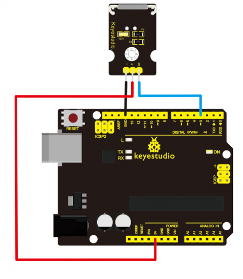](https://wiki.keyestudio.com/File:Ks0038-1.png)  

Sample Code:  
Copy and paste the below code to Arduino software.  
```c++
int Led = 13;      //define LED interface
int buttonpin = 3; //define magnetic ring sensor interface
int val;           //define digital variable val
void setup()
{
    pinMode(Led, OUTPUT);      //define LED as output interface
    pinMode(buttonpin, INPUT); //define magnetic ring sensor as output interface
}
void loop()
{
    val = digitalRead(buttonpin); // read and assign the value of digital interface 3 to val
    if (val == HIGH)              //When a signal is detected by magnetic ring sensor, LED will flash
    {
    digitalWrite(Led, HIGH);
    }
    else
    {
    digitalWrite(Led, LOW);
    }
}
```
Example Result:  
Done wiring and powered up, upload well the code to the board. You can see the D13 led on UNO board is on.    
[](https://wiki.keyestudio.com/File:KS0349_17-3.png)  

Then we put some magnetic balls close to the sensor. When the sensor detects the magnetic field signal, the led on the sensor will be turned on but D13 led will be turned off.    
[](https://wiki.keyestudio.com/File:KS0349_17-4.png)  


Project 18: PIR Motion Sensing

[](https://wiki.keyestudio.com/File:KS0349_18-1.png)  

Description:  
Pyroelectric infrared motion sensor can detect infrared signals from a moving person or moving animal, and output switching signals. It can be applied to a variety of occasions to detect the movement of human body. Conventional pyroelectric infrared sensors require body pyroelectric infrared detector, professional chip and complex peripheral circuit, so the size is much more bigger, with complex circuit and lower reliability. Now we launch this new pyroelectric infrared motion sensor, specially designed for Arduino. It uses an integrated digital body pyroelectric infrared sensor, with smaller size, higher reliability, lower power consumption and simpler peripheral circuit.  

Specification:  
Input Voltage: 3.3 \~ 5V, Maximum for 6V  
Working Current: 15uA  
Working Temperature: -20 \~ 85 ℃  
Output Voltage: High 3V, low 0V  
Output Delay Time (High Level): About 2.3 to 3 Seconds  
Detection angle: 100 °  
Detection distance: 7 meters  
Output Indicator LED (When output HIGH, it will be ON)  
Pin limit current: 100mA  
Size: 30\*20mm  
Weight: 4g  

Connection Diagram:    
First, you need to prepare the following parts before connection:  
UNO Board\*1    
PIR motion sensor\*1    
USB Cable\*1    
Jumper Wire\*3  

Connect the S pin of module to Digital 3 of UNO board, connect the negative pin to GND port, positive pin to 5V port.  

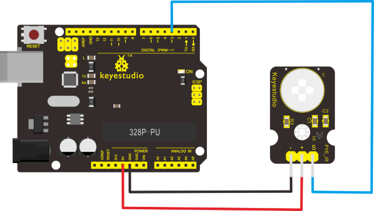

Sample Code:  
Copy and paste the below code to Arduino software.
```c++
byte sensorPin = 3;
byte indicator = 13;
void setup()
{
    pinMode(sensorPin, INPUT);
    pinMode(indicator, OUTPUT);
    Serial.begin(9600);
}
void loop()
{
    byte state = digitalRead(sensorPin);
    digitalWrite(indicator, state);
    if (state == 1)Serial.println("Somebody is in this area!");
    else if (state == 0)Serial.println("No one!");
    delay(500);
}
```
Example Result:  
Done wiring and powered up, upload well the code, if the sensor detects someone moving nearby, D13 indicator on UNO board will light up, and "Somebody is in this area!" is displayed on the serial monitor of Arudino software. If no detecting the movement, D13 indicator on UNO board will be off, and "No one!" is displayed on the serial monitor.    
[](https://wiki.keyestudio.com/File:KS0349_18-2.png)  

[](https://wiki.keyestudio.com/File:KS0349_18-3.png)  


Project 19: Analog Temperature

[](https://wiki.keyestudio.com/File:KS0349_19-1.png)

Description:  
This module is based on the working principle of a thermistor (resistance varies with temperature change in the environment). It can sense temperature changes in the surrounding and send the data to the analog IO of Arduino board. All we need to do is to convert the sensor’s output data into degrees Celsius temperature via simple programming, finally displaying it on the monitor. It's both convenient and effective, thus it is widely applied to gardening, home alarm system and other devices.  

Specification:  
Interface type: analog  
Working voltage: 5V  
Temperature range: -55℃～315℃  
Size: 30\*20mm  
Weight: 3g  

Connection Diagram:    
First, you need to prepare the following parts before connection:    
UNO Board\*1     
Analog temperature sensor\*1    
USB Cable\*1    
Jumper Wire\*3  

Connect the S pin of module to Analog A0 of UNO board, connect the negative pin to GND port, positive pin to 5V port.    

[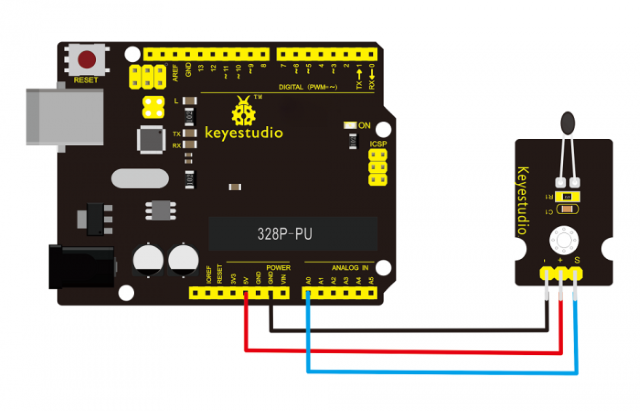](https://wiki.keyestudio.com/File:Ks0033-.png)  

Sample Code:    
Copy and paste the below code to Arduino software.  
```c++
void setup()
{ Serial.begin(9600);
}
// the loop routine runs over and over again forever:
void loop()
{ int sensorValue = analogRead(A0);
    Serial.println(sensorValue);
    delay(1);
}
```
The above code is only for analog value. You can see that the analog value is changing according to the temperature change in the environment. But it’s not very obvious. Let’s solve this by using the following equation. Then upload the code below to the Arduino board. The value read from the serial port is similar to normal temperature. eg. The temperature right now is 30°C.  
```c++
#include <math.h>
void setup()
{
    Serial.begin(9600);
}
void loop()
{
    double val = analogRead(0);
    double fenya = (val / 1023) * 5;
    double r = (5 - fenya) / fenya * 4700;
    Serial.println( 1 / (
    log(r / 10000) / 3950 + 1 / (25 + 273.15)) - 273.15);
    delay(1000);
}
```
Example Result:  
Done wiring and powered up, upload well the code, then open the serial monitor, you will see the current temperature value. Shown below.     
[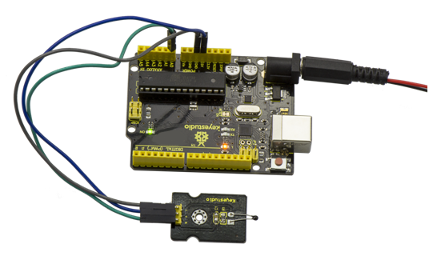](https://wiki.keyestudio.com/File:KS0349_19-2.png)

  


Project 20: Analog Rotation

[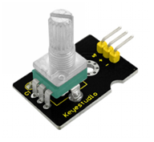](https://wiki.keyestudio.com/File:KS0349_20-1.png)  

Description:  
This analog rotation sensor is Arduino compatible. It is based on a potentiometer. Its voltage can be subdivided into 1024, easy to be connected to Arduino with our sensor shield. Combined with other sensors, you can use it to make interesting projects by reading the analog value from the IO port.  

Specification:  
Supply Voltage: 3.3V to 5V  
Interface: Analog  
Size: 30\*20mm  
Weight: 8g  

Connection Diagram:  
Connect the S pin of module to Analog A0 of UNO board, connect the negative pin to GND port, positive pin to 5V port.    
[](https://wiki.keyestudio.com/File:Ks0014.png)  

Sample Code:    
Copy and paste the below code to Arduino software.  
```c++
void setup()
{
    Serial.begin(9600);       //Set serial baud rate to 9600 bps
}
void loop()
{
    int val;
    val = analogRead(0);      //Read rotation sensor value from analog 0
    Serial.println(val, DEC); //Print the value to serial port
    delay(100);
}
```
Example Result:  

[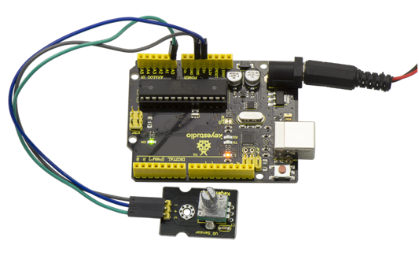](https://wiki.keyestudio.com/File:KS0349_20-2.png)  

Done wiring and powered up, upload well the above code, then open the serial monitor and set the baud rate as 9600, finally you will see the analog value. If rotate the knob on the rotation sensor, the value will be changed within 0-1023.  
Shown below.  
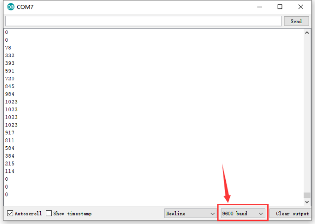


Project 21: Photocell

[](https://wiki.keyestudio.com/File:KS0349_21-1.png)  

Description:  
Photocell is commonly seen in our daily life and is mainly used in intelligent switch, also in common electronic design. To make it easier and more effective, we supply the corresponding modules. Photocell is a semiconductor. It has features of high sensitivity, quick response, spectral characteristicand R-value consistence, maintaining high stability and reliability in environment extremely such as high temperature and high humidity. It’s widely used in automatic control switch fields like cameras, garden solar lights, lawn lamps, money detectors, quartz clocks, music cups, gift boxes, mini night lights, sound and light control switches, etc.  

Specification:  
Interface type: analog  
Working voltage: 5V  
Size: 30\*20mm  
Weight: 3g  

Connection Diagram:   
Connect the S pin of module to Analog A0 of UNO board, connect the negative pin to GND port, positive pin to 5V port.    
[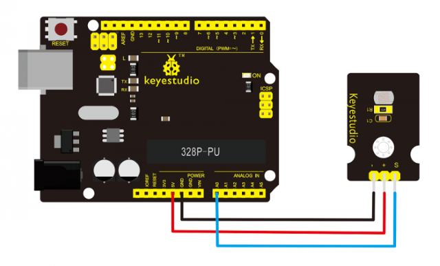](https://wiki.keyestudio.com/File:Ks0028.png)  

Sample Code:   
Copy and paste the below code to Arduino software.
```c++
int sensorPin = A0 ;
int value = 0;
void setup()
{
    Serial.begin(9600);
}
void loop()
{
    value = analogRead(sensorPin);
    Serial.println(value, DEC);
    delay(50);
}
```
Example Result:  
[](https://wiki.keyestudio.com/File:KS0349_21-2.png)  

Done wiring and powered up, upload well the code, then open the serial monitor, if cover the photocell on the sensor with your hand, you will see the analog value decrease. Shown as below.  
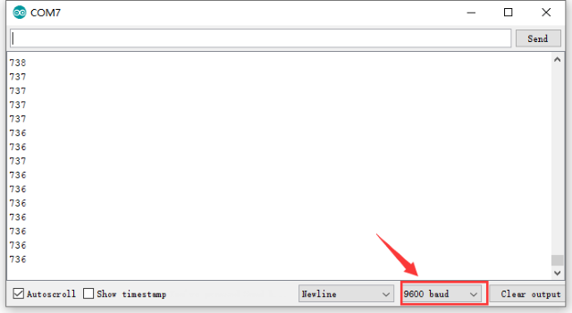   


Project 22: Analog Sound

[](https://wiki.keyestudio.com/File:Ks0035(1).png)  

Description:  
Analog sound sensor is typically used in detecting the volume ofambient sounds. You can use it to make some interesting and interactive works, such as a voice operated switch.  

Specification:  
Supply Voltage: 3.3V to 5V  
Interface: Analog  
Size: 30\*20mm  
Weight: 4g  

Connection Diagram:    
Analog sound sensor is typically used in detecting the volume ofambient sounds. You can use it to make some interesting and interactive works, such as a voice operated switch.     
[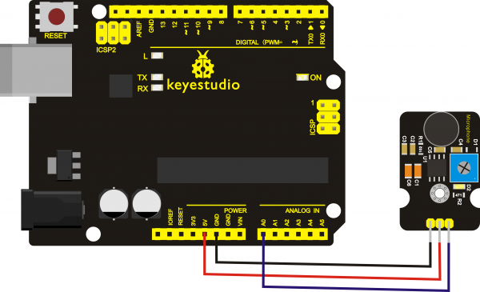](https://wiki.keyestudio.com/File:Ks0035(2).png)  

Sample Code:  
Copy and paste the below code to Arduino software.
```c++
void setup()
{
    Serial.begin(9600);       // open serial port, set the baud rate at 9600 bps
}
void loop()
{
    int val;
    val = analogRead(0);      //connect mic sensor to Analog 0
    Serial.println(val, DEC); //print the sound value on serial monitor
    delay(100);
}
```
Example Result:  
Done wiring and powered up, upload well the code, then open the serial monitor and set the baud rate as 9600, you will see the analog value. When talking toward the micro head, the value will increase. Shown below.     
[](https://wiki.keyestudio.com/File:Ks0035(3).png)    


Project 23: Water Level

[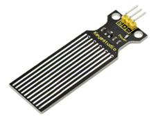](https://wiki.keyestudio.com/File:KS0349_23-1.png)    

Description:  
Keyestudio water sensor is easy- to-use, portable and cost-effective, designed to identify and detect water level and water drop. This smaller sensor can measure the volume of water drop or water quantity through an array of traces of exposed parallel wires.

Features:  

smooth conversion between water quantity and analog quantity;  

strong flexibility, outputting basic analog value;  

low power consumption and high sensitivity;  

directly connect to microprocessor or other logic circuits, suitable for a variety of development boards and controllers such as Arduino controller, STC single-chip microcomputer, AVR single-chip microcomputer and more.    

Specification:  
Operating voltage: DC5V  
Operating current: ﹤20mA  
Sensor type: Analog  
Detection area: 40mm x16mm  
Production process: FR4 double-side tinned  
Shape design: Anti-skid semi-lunar recess  
Working Temperature: 10℃-30℃  
Working Humidity: 10%-90% without condensation  
Weight: 3g  
Dimensions: 65mm x 20mm x 8mm  

Connection Diagram:  
Connect the S pin of module to Analog A0 of UNO board, connect the negative pin to GND port, positive pin to 5V port.  
[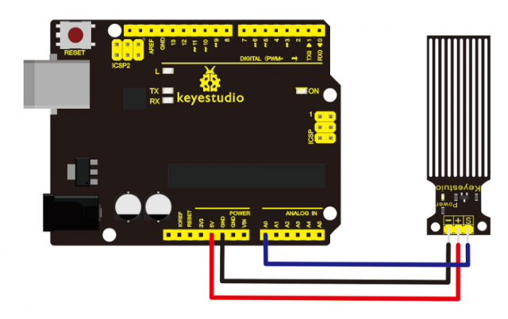](https://wiki.keyestudio.com/File:Ks0048-1.png)  

Sample Code:  
Copy and paste the below code to Arduino software.  
```c++
int analogPin = 0;     //connect water sensor to analog interface 0
int led = 13;          //LED to digital interface 13
int val = 0;           //define the initial value of variable ‘val’ as 0
int data = 0;          //define the initial value of variable ‘data’ as 0
void setup()
{
    pinMode(led, OUTPUT);        //define led as output pin
    Serial.begin(9600);          //set baud rate at 9600
}
void loop()
{
    val = analogRead(analogPin); //read and assign analog value to variable ’val’
    if (val > 700) {             //decide whether variable ‘val’ is over 700
    digitalWrite(led, HIGH);     //turn on LED when variable ‘val’ is over 700
    }
    else {
    digitalWrite(led, LOW);      //turn off LED when variable ‘val’ is under 700
    }
    data = val;                  //variable ’val’ assigns value to variable ‘data’
    Serial.println(data);        //print variable ‘data’ by Serial.print
    delay(100);
}
```
Example Result:

[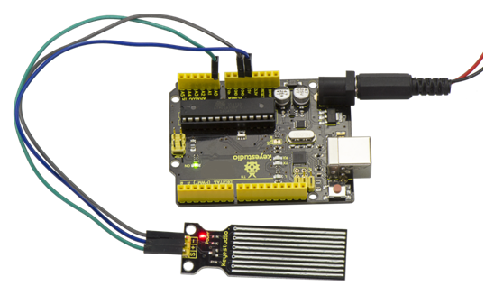](https://wiki.keyestudio.com/File:KS0349_23-3.png)

After the above steps are done, let’s do a test on lower water level and check what happens ? upload well the code to UNO board, then open the serial monitor and set the baud rate as 9600. When place the sensor into the water at different level, you will see the value change correspondingly.  

  
Furthermore, you can set an alarm value and connect a buzzer to make an alarm. The LED can’t light up when water level haven’t reach alarm value. If water level reaches the alarm value, LED will be turned on and buzzer will sound to make an alarm.


Project 24: Soil Moisture

[](https://wiki.keyestudio.com/File:KS0349_24-1.png)

Description:  
This is a simple soil humidity sensor aimed to detect the soil humidity. If the
soil is in lack of water, the analog value output by the sensor will decrease,
otherwise, it will increase.  
If you use this sensor to make an automatic watering device, it can detect
whether your botany is thirsty to prevent it from withering when you go out.
Combine this sensor with Arduino controller can make your plant more comfortable
and your garden more smarter.

The soil humidity sensor module is not as complicated as you might think, so if you need to detect the soil in your project, it will be your best choice. The sensor is set with two probes which are inserted into the soil.If the current goes through the soil, the sensor will get resistance value by reading the current changes between the two probes, then convert the resistance value into moisture content. The higher moisture (less resistance), the higher conductivity the soil has. The surface of the sensor has undergone metallization process to prolong its service life. Insert it into the soil and then use the AD converter to read it. With the help of this sensor, the plant can remind of you: I need water.  

Specification:  
Power Supply Voltage: 3.3V or 5V  
Working Current: ≤ 20mA  
Output Voltage: 0-2.3V (When the sensor is totally immersed in water, the voltage will be 2.3V) The higher humidity, the higher the output voltage.  
Sensor type: Analog output  
Interface definition: Pin1- signal, Pin2- GND, Pin3 - VCC  
Servicelife: About one year (gold-plated surface for enhancing conductivity and corrosion resistance)  
Module size: 20\*60mm  

Connection Diagram:    
Connect the S pin of module to Analog A0 of UNO board, connect the negative pin to GND port, positive pin to 5V port.    
[](https://wiki.keyestudio.com/File:0049.png)

Sample Code:  
Copy and paste the below code to Arduino software.  
```c++
/*
    # Example code for the moisture sensor
    # Connect the sensor to the A0(Analog 0) pin on the Arduino board
    # the sensor value description
    # 0~300 dry soil
    # 300~700 humid soil
    # 700~950 in water
*/
void setup() {
    Serial.begin(57600);
}
void loop() {
    Serial.print("Moisture Sensor Value:");
    Serial.println(analogRead(0));
    delay(100);
}
```
Example Result:  
[](https://wiki.keyestudio.com/File:KS0349_24-3.png)

Done wiring and powered up, upload well the code, then open the serial monitor and set the baud rate as 57600, you will see the value. When the sensor detects the moisture, the value will make corresponding changes. Shown below.    
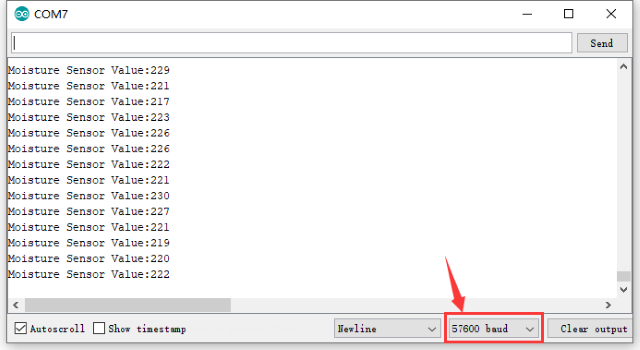  


Project 25: Steam Moisture 
  

Description:  
Vapor Sensor is an analog sensor and can make a simple rainwater detector and liquid level switch. When humidity on the face of this sensor rises, output voltage will increase. Caution: connection parts is non-waterproof, so please don’t put them into water.  

Parameters:  
Working Voltage: 3.3V or 5V  
Working Current: \< 20mA  
Range of Working Temperature: －10℃～＋70℃ 
Interface Type: Analog Signal Output  
Size: 36mm x 20mm  

Pin Definition:  
S pin: for Signal Output  
Positive pin (+): for Power Supply (VCC)  
Negative pin (-): for Ground (GND)  

Connection Diagram:    
First, you need to prepare the following parts before connection:   
UNO board\*1    
Steam sensor\*1    
USB Cable\*1    
Jumper wire\*3   

Connect the S pin of module to Analog A0 of UNO board, connect the negative pin to GND port, positive pin to 5V port.    

[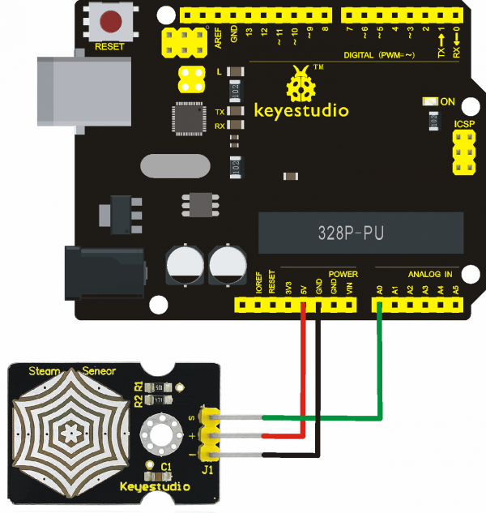](https://wiki.keyestudio.com/File:Project_37-2.png)    

Sample Code:    
Copy and paste the below code to Arduino software.   
```c++
void setup()
{
    Serial.begin(9600); //open serial port, and set baud rate at 9600bps
}
void loop()
{
    int val;
    val = analogRead(0); //plug vapor sensor into analog port 0
    Serial.print("Moisture is ");
    Serial.println(val, DEC); //read analog value through serial port printed
    delay(100);
}
```
Example Result:  

[](https://wiki.keyestudio.com/File:KS0349_27-2.png)

When detecting different degrees of humidity, the sensor will get the feedback of different current value. Shown as the following picture.Due to the limited condition, you can put a drop of water on the sensor, the moisture value will be changed on serial monitor of Arduino software.      
  


Project 26: Analog Ceramic Vibration

[](https://wiki.keyestudio.com/File:KS0349_28-1.png)

Description:  
This vibration sensor is based on piezoelectric ceramic chip analog vibration. It makes use of the anti-conversion process that piezoelectric ceramic vibration will generate the electric signals. When vibrating the piezoelectric ceramic chip, the sensor’s signal terminal will generate electrical signals. The sensor can be used with Arduino dedicated sensor shield, and Arduino analog port can perceive weak vibration signals, so that it can make interactiveworks related to vibration, such as electronic drum. Connect the vibration sensor to the analog port A0 of Arduino UNO. When vibrating the sensor in different degrees, you will see the different output value displayed on serial monitor of Arduino software.   

Parameters:
Supply Voltage: 3.3V to 5V  
Working Current：\< 1mA  
WorkingTemperature Range：－10℃～＋70℃  
Output Signal：analog signal  
Weight: 4.4g  

Connection Diagram:    
First, you need to prepare the following parts before connection:   
UNO board\*1    
vibration sensor\*1    
USB Cable\*1    
Jumper wire\*3  

Connect the S pin of module to Analog A0 of UNO board, connect the negative pin to GND port, NC pin to 5V port.    

[](https://wiki.keyestudio.com/File:KS0349_28-2.png)

Sample Code:  
Copy and paste the below code to Arduino software.  
```c++
void setup()
{
    Serial.begin(9600); //Open the serial to set the baud rate as 9600bps
}
void loop()
{
    int val;
    val = analogRead(0); //Connect the sensor to analog interface A0
    Serial.print("Vibration is ");
    Serial.println(val, DEC); //Print the analog value read on serial port
    delay(100);
}
```
Example Result:

[](https://wiki.keyestudio.com/File:KS0349_28-3.png)

Wiring as the above diagram and upload well the code, then open the serial monitor and set the baud rate as 9600. When vibrating the ceramic chip, you will see the data change as the figure shown below.     
    


Project 27: Voltage Detection

[](https://wiki.keyestudio.com/File:KS0349_29-1.png)

Description:  
Since the electronic products are various, the voltage of the power supply is also different. It is indeed necessary to detect it with a suitable voltage detection module or controller. The maximum input voltage of the controller’s analog interface is 5V, which means that the voltage greater than 5V will not be detected. However, this voltage detection module canachieve to detect the voltagegreater than 5 V. It is designed on the basis of resistive voltage divider principle, which can make the input voltage of bindingpost interface narrow 5 times, and the analog input voltage is up to 5 V, thus the input voltage of voltage detection module is not greater than 5V * 5 = 25 V (if using 3.3 V system, the input voltage is not greater than 3.3 V*5 = 16.5 V). The AVR chip is 10-bit AD, so the analog resolution of this module is 0.00489V (5V / 1023), and the minimum input voltage is 0.00489V * 5 = 0.02445 V. When connect this sensor to expansion board using 3Pinwire, it can not only easily detect the magnitude of the voltage power and monitor the electric quantity of battery for interactive media works or robot, but also can combine with IICLCD1602 LCD module to display the voltage or make a voltage monitor.  

Parameters: 
Working voltage: 0V-25VDC  
Signal type: analog signal  
Size: 35\*20\*14mm  

Connection Diagram:    
First, you need to prepare the following parts before connection:    
UNO board\*1    
Voltage sensor\*1    
USB Cable\*1    
Jumper wire\*3  

Connect the S pin of module to Analog A0 of UNO board, connect the negative pin to GND port, NC pin to 5V port.  

[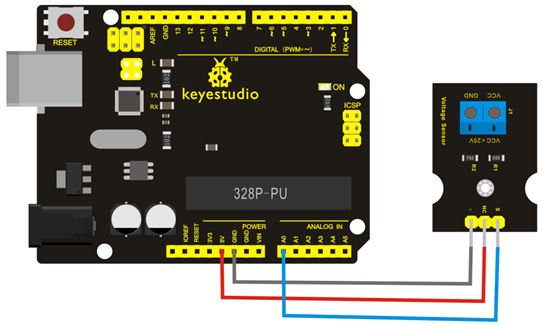](https://wiki.keyestudio.com/File:KS0349_29-2.png)

Sample Code:    
Copy and paste the below code to Arduino software.  
```c++
int analogpin = 0;   // Define analogpin as analog port 0
int val, val5;       //Define variablesval,val5
int val2 = 0;        //Define variablesval2
int val3 = 0;        //Define variablesval3
int val4 = 0;        //Define variablesval4
void setup()
{
    Serial.begin(9600);  //Set baud rate of 9600
}
void loop()
{
    int val, val5;
    float val1;
    val = analogRead(analogpin);  //Read the value of the analog port and assign it to the variableval
    val1 = val / 3.9;
    val5 = (int)val1;
    val3 = val5 / 100;
    val2 = (val5 % 100) / 10;
    val4 = val5 % 10;
    Serial.print("$CLEAR\r\n");  //clear the screen
    Serial.print("$GO 1 1\r\n");
    Serial.print("$PRINT Voltage:\r\n");
    Serial.print("$GO 1 9\r\n");
    Serial.print("$PRINT ");
    Serial.print(val3);         //The serial port prints the value of the variable val3
    Serial.print(val2);         //The serial port prints the value of the variable val2
    Serial.print(".");          //The serial port prints out a point"."
    Serial.print(val4);         //The serial port prints the value of the variable val4
    Serial.println("V");        //The serial port prints out capital “ V”
    delay(1000);                //delay 1 second
}
```
Example Result:

  
Done as the above wiring, compile and upload the code, powered-on, then open the serial port monitor, it will print out the detected voltage value shown below.    


Project 28: Digital IR Receiver

[](https://wiki.keyestudio.com/File:KS0349_33-1.png)

Description:  
IR is widely used in remote control. With this IR receiver, Arduino project is able to receive command from any IR remoter controllers if you have the right decoder. Well, it will be also easy to make your own IR controller using IR transmitter.  

Specification:  
Power Supply: 5V  
Interface:Digital  
Modulation Frequency: 38Khz  
Module Interface Socket:JST PH2.0  
Size: 30\*20mm  
Weight: 4g  

Connection Diagram:    
Firstly you need to prepare the following parts before connection:    
UNO Board\*1    
IR Receiver module\*1    
USB Cable\*1    
Jumper Wire\*3    

Connect the S pin of module to Digital 11 of UNO board, connect the negative pin to GND port, positive pin to 5V port.    

[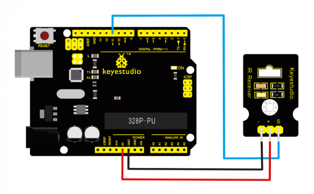](https://wiki.keyestudio.com/File:Ks0026.png)

NOTE: In the sample code below Digital pin 11 is in use, you may either change your wiring or change the sample code to match.    

Sample Code:  
Copy and paste the code below to Arduino software.    
```c++
#include <IRremote.h>
int RECV_PIN = 11;
IRrecv irrecv(RECV_PIN);
decode_results results;
void setup()
{
    Serial.begin(9600);
    irrecv.enableIRIn(); // Start the receiver
}
void loop() {
    if (irrecv.decode(&results)) {
    Serial.println(results.value, HEX);
    irrecv.resume(); // Receive the next value
    }
}
```
Note: before compiling the code, do remember to place the library into libraries directory of Arduino IDE. Otherwise, compiling will fail. IR Remote Library Includes some sample codes for sending and receiving.      
<https://github.com/shirriff/Arduino-IRremote>  

Example Result:

[](https://wiki.keyestudio.com/File:KS0349_33-3.png)

Done wiring and uploading the code, then control the IR receiver module by an infrared remote control, D1 led will flash. Shown as below.      
[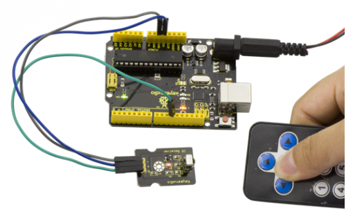](https://wiki.keyestudio.com/File:KS0349_33-4.png)


Project 29: Digital IR Transmitter

[](https://wiki.keyestudio.com/File:KS0349_34-1.png)

Description:    
IR transmitter module is designed for IR communication, which is widely used for operating the television device from a short line-of-sight distance. Since infrared (IR) remote control uses light, it requires line of sight to operate the destination device. The signal can, however, be reflected by mirrors, just like any other light sources. Infrared receivers also tend to have a more or less limited operating angle, which mainly depends on the optical characteristics of the phototransistor. However, it’s easy to increase the operating angle using a matte transparent object in front of the receiver.  

Specification:  
Power Supply: 3-5V  
Infrared center frequency: 850nm-940nm  
Infrared emission angle: about 20degrees  
Infrared emission distance: about 1.3m (5V 38Khz)  
Interface socket: JST PH2.0  
Mounting hole: inner diameter is 3.2mm, spacing is 15mm  
Size: 35\*20mm  
Weight: 3g  

Connection Diagram:    
Firstly you need to prepare the following parts before connection:    
UNO Board\*1  
IR Transmitter module\*1    
USB Cable\*1   
Jumper Wire\*3  

Connect the S pin of module to Digital 3 of UNO board, connect the negative pin to GND port, positive pin to 5V port.  

[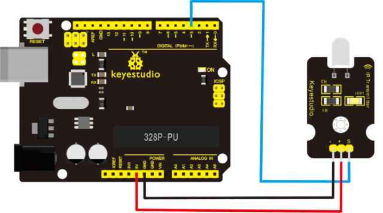](https://wiki.keyestudio.com/File:Ks0027.png)

NOTE: In the sample code below Digital pin 11 is in use, you may either change your wiring or change the sample code to match.   

Sample Code:  
Copy and paste the code below to Arduino software.  
```c++
int led = 3;
void setup() {
    pinMode(led, OUTPUT);
}
void loop() {
    digitalWrite(led, HIGH);
    delay(1000);
    digitalWrite(led, LOW);
    delay(1000);
}
```
Upload well the above code to the board, the led on the sensor will blink red light.   
In the following, let’s move on to an interactive example between IR receiver and IR transmitter module.    

Infrared Remote/Communication: Hardware Required

UNO R3 x2
Digital IR Receiver x1
IR Transmitter Module x1
Jumper Wire x6
USB cable x2

Note: here if you have no two main boards, you can replace it with the breadboard for connection, may be more easier and convenient.  

Connection Diagram:  
For IR Transmitter:as same as the above diagram, but note that Arduino-IRremote only supports D3 as transmitter.    
[](https://wiki.keyestudio.com/File:Ks0027.png)

For IR Receiver: connect the signal pin to D11 port.  
[](https://wiki.keyestudio.com/File:Ks0027-2.png)

Sample Code:

Note: you need to install library, that is, place IRremote folder into the libraries of Arduino.  

Next, reboot compiler.

Download library in the resource link.

Upload Code to UNO Board Connected with IR Transmitter:

See library in the resource link
```c++
#include <IRremote.h>
IRsend irsend;
void setup()
{}
void loop() {
    irsend.sendRC5(0x0, 8); //send 0x0 code (8 bits)
    delay(200);
    irsend.sendRC5(0x1, 8);
    delay(200);
}
```
Upload Code to UNO Board Connected with IR Receiver:
```c++
#include <IRremote.h>
const int RECV_PIN = 11;
const int LED_PIN = 13;
IRrecv irrecv(RECV_PIN);
decode_results results;
void setup()
{ Serial.begin(9600);
    irrecv.enableIRIn(); // Start the receiver
}
void loop()
{ if (irrecv.decode(&results))
    { if ( results.bits > 0 )
    {
        int state;
        if ( 0x1 == results.value )
        {
        state = HIGH;
        }
        else
        {
        state = LOW;
        }
        digitalWrite( LED_PIN, state );
    }
    irrecv.resume(); // prepare to receive the next value
    }
}
```
Example Result:  
When IR Receiver module receives the infrared signal from IR Transmitter, D1 ledon the IR Receiver module will blink.Shown as below figure.    
[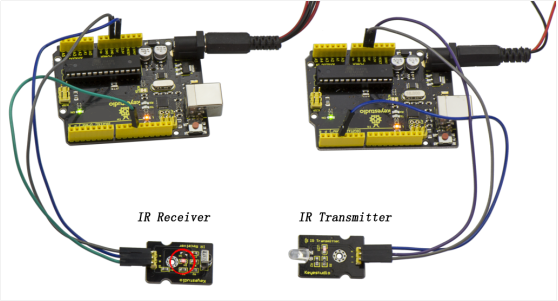](https://wiki.keyestudio.com/File:KS0349_34-5.png)

Note: This IR transmitter module is not compatible with Mega2560 main board because IRremoteInt.h has no PWM port for AVR_ATmega2560_device; but UNO is default using pin3.  


Project 30: Pulse Rate Monitor

[](https://wiki.keyestudio.com/File:KS0349_35-1.png)

Description:  
This module makes use of a ultra-clear infrared LED and a phototransistor to detect the pulse in your finger. The red LED will flash in time with your pulse.  

Working principle: Shine the bright LED onto one side of your finger while the phototransistor on the other side of your finger picks up the amount of transmitted light. The resistance of the phototransistor will vary slightly as the blood pulses go through your finger.  

Part List:  
Firstly you need to prepare the following parts before making a test.  

UNO Board\*1   
Pulse module\*1   
USB Cable\*1   
Jumper Wire\*3   

Connection Diagram:  
Connect the Signal pin of module to Analog A0 of UNO board, connect the positive pin to 5V port, negative pin to GND port.    
[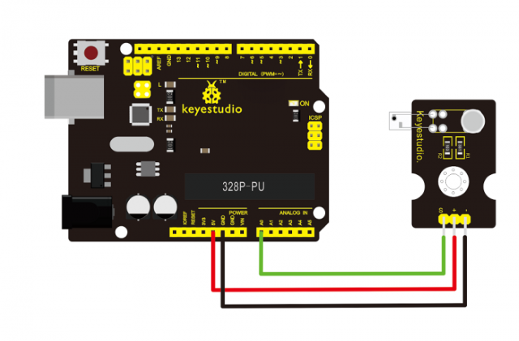](https://wiki.keyestudio.com/File:Ks0015.png)

Sample Code:  
Copy and paste the code below to Arduino software.  
```c++
int ledPin = 13;
int sensorPin = 0;
double alpha = 0.75;
int period = 20;
double change = 0.0;
void setup()
{
    pinMode(ledPin, OUTPUT);
    Serial.begin(115200);
}
void loop()
{
    static double oldValue = 0;
    static double oldChange = 0;
    int rawValue = analogRead(sensorPin);
    double value = alpha * oldValue + (1 - alpha) * rawValue;
    Serial.print(rawValue);
    Serial.print(",");
    Serial.println(value);
    oldValue = value;
    delay(period);
}
```
Example Result:  
Wire it up well as the above diagram, then upload well the code to the board and click the icon of serial monitor on the upper right corner of Arduino software. Set the baud rate as 115200, you will see the data is displayed on the monitor. You can copy and paste the data to the excel, finally it will generate the corresponding picture shown below.     
[](https://wiki.keyestudio.com/File:35-1.png)  
[](https://wiki.keyestudio.com/File:35-2.png)  

[](https://wiki.keyestudio.com/File:35-3.png)  


Project 31: Joystick

[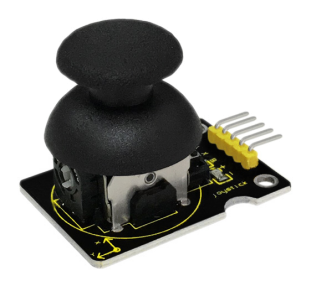](https://wiki.keyestudio.com/File:Ks0008_joystick.png)

Description:  
Lots of robot projects need joystick. This module provides an affordable solution. By simply connecting to two analog inputs, the robot is at your commands with X, Y control. It also has a switch that is connected to a digital pin.  

Specification:  
Supply Voltage: 3.3V to 5V  
Interface: Analog x2, Digital x1  
Size: 40\*28mm  
Weight: 12g  

Connection Diagram:  
Firstly you need to prepare the following parts before connection:  
UNO Board\*1  
Joystick module\*1  
USB Cable\*1  
Jumper Wire\*5  

Connect the Y pin of module to Analog A1 of UNO board, connect the X pin to Analog A0, B pin to Digital 3; Connect negative pin to GND port, positive pin to 5V port.  
[](https://wiki.keyestudio.com/File:Ks0008-1.png)

Sample Code:  
Copy and paste the code below to Arduino software.  
```c++
int JoyStick_X = 0; //x
int JoyStick_Y = 1; //y
int JoyStick_Z = 3; //key
void setup()
{
    pinMode(JoyStick_Z, INPUT);
    Serial.begin(9600); // 9600 bps
}
void loop()
{
    int x, y, z;
    x = analogRead(JoyStick_X);
    y = analogRead(JoyStick_Y);
    z = digitalRead(JoyStick_Z);
    Serial.print(x , DEC);
    Serial.print(",");
    Serial.print(y , DEC);
    Serial.print(",");
    Serial.println(z , DEC);
    delay(100);
}
```
Example Result:

[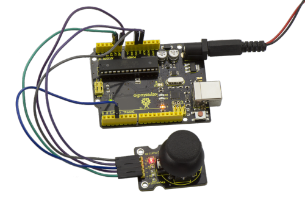](https://wiki.keyestudio.com/File:36.png)

Wiring well and uploading the code, open the serial monitor on Arduino software, and set the baud rate as 9600, you will see the value shown below.    
  

If you push the joystick downward/upward/leftward/rightward, the data will be changed. Shown as the figure below.  

Push downward  
  

Push upward  
  

Push leftward  
  

Push rightward  
  


Project 32: Rotary Encoder

[](https://wiki.keyestudio.com/File:Ks0013_rotary_encoder.png)

Introduction:  
The rotary encoder can count the pulse outputting times during the process of rotation in positive and reverse direction. This rotating counting is unlimited, not like potential counting. It can be restored to initial state to count from 0.  

Specification:  
Power Supply: 5V  
Interface: Digital  
Size: 30\*20mm  
Weight: 7g  

Connection Diagram:    
[](https://wiki.keyestudio.com/File:Ks0013-1.png)

As seen in the diagram, we connect rotary encoder module and two LED modules to the breadboard and UNO board. This way use the rotary encoder module to control two LED modules on and off.    

Sample Code:  
Copy and paste the code below to Arduino software.    
```c++
const int interruptA = 0; 
const int interruptB = 1;
int CLK = 2; // pin2
int DAT = 3; // PIN3
int BUTTON = 4; // PIN4
int LED1 = 5; // PIN5
int LED2 = 6; // PIN6
int COUNT = 0;
void setup()
{
attachInterrupt(interruptA, RoteStateChanged, FALLING);
 // attachInterrupt(interruptB, buttonState, FALLING);
pinMode(CLK, INPUT);// Pull High Resistance
digitalWrite(2, HIGH); // Pull High Resistance
pinMode(DAT, INPUT); 
digitalWrite(3, HIGH); //Pull High Resistance
pinMode(BUTTON, INPUT); 
digitalWrite(4, HIGH); //Pull High Resistance
pinMode(LED1, OUTPUT);
pinMode(LED2, OUTPUT);
Serial.begin(9600);
}
void loop()
{
if (digitalRead(BUTTON)==LOW)
{
COUNT = 0; 
Serial.println("STOP COUNT = 0");
digitalWrite(LED1, LOW);
digitalWrite(LED2, LOW);
delay (2000);
}
Serial.println(COUNT);
}
void RoteStateChanged() 
{
if (digitalRead(DAT)==HIGH) 
{
COUNT++;
digitalWrite(LED1, HIGH);
digitalWrite(LED2, LOW);
delay(200);
}
else 
{
COUNT--;
digitalWrite(LED2, HIGH);
digitalWrite(LED1, LOW);
delay(200);
}
}
```
Example Result:  
Wiring well and uploading the above code, you can rotate the encoder module to
randomly control two LED modules on and off. When you rotate the encoder module,
one LED module is turned on first but another one is off. If you continue to
rotate the encoder module, one LED module becomes off while another one is
turned on, repeatedly.  
[](https://wiki.keyestudio.com/File:Ks0349-37-2.png)


Project 33: Single Relay

[](https://wiki.keyestudio.com/File:Ks0011.png)

Introduction:  
This single relay module can be used in interactive projects. This module uses SONGLE 5v high-quality relay. It can also be used to control lighting, electrical and other equipment. The modular design makes it easy to expand with Arduino board. The relay output is by a light-emitting diode. It can be controlled through digital IO port, such as solenoid valves, lamps, motors and other high current or high voltage devices.  

Specification:  
1. Type: Digital  
2. Rated current: 10A (NO) 5A (NC)  
3. Maximum switching voltage: 150VAC 24VDC  
4. Digital interface  
5. Control signal: TTL level  
6. Rated load: 8A 150VAC (NO), 10A 24VDC (NO), 5A 250VAC (NO/NC), 5A 24VDC (NO/NC)  
7. Maximum switching power: AC1200VA DC240W (NO), AC625VA DC120W (NC)  
8. Contact action time: 10ms  
9. Size: 40\*28mm  
10. Weight: 15g  

Connection Diagram:    
Firstly you need to prepare the following parts before connection:   
UNO Board\*1  
Relay module\*1  
LED module \*1  
Breadboard \*1  
USB Cable\*1  
Jumper Wire\*9  

Here we use the single relay module to control an LED module on or off. So first connect well all the components as the below diagram shown. For relay module, connect the Signal pin to Digital port 8 of UNO board, then connect its positive pin to anode row of breadboard, lead off the row to 5V port of UNO board. Connect its negative pin to cathode row of breadboard, lead off the row to GND port of UNO board.  

For LED module, connect its Signal pin to one terminal block of relay module, another terminal block on the relay is connected to Digital port 13 of UNO board. Connect its positive pin to anode row, negative pin to cathode row of breadboard.

[](https://wiki.keyestudio.com/File:Ks0011-1.png)

Sample Code:  
Copy and paste the code below to Arduino software.  
```c++
int Relay = 8;
void setup()
{
    pinMode(13, OUTPUT);  //Set Pin13 as output
    digitalWrite(13, HIGH);  //Set Pin13 High
    pinMode(Relay, OUTPUT);  //Set Pin3 as output
}
void loop()
{
    digitalWrite(Relay, HIGH);  //Turn off relay
    delay(2000);
    digitalWrite(Relay, LOW);  //Turn on relay
    delay(2000);
}
```
Example Result:  
This relay module is active at HIGH level.  
Wire it up well, powered up, then upload the above code to the board, you will see the relay is turned on（ON connected, NC disconnected）for two seconds, then turned off for two seconds（NC closed,ON disconnected）, repeatedly and circularly. When the relay is turned on, external LED is on. If relay is turned off, external LED is off.    
[](https://wiki.keyestudio.com/File:Ks0349-38-2.png)


Project 34: Linear Temperature

[](https://wiki.keyestudio.com/File:Ks0022-2.png)

Introduction:  
LM35 Linear Temperature Sensor is based on semiconductor LM35 temperature sensor. It can be used to detect ambient air temperature. This sensor offers a functional range among 0 degree Celsius to 100 degree Celsius. Sensitivity is 10mV per degree Celsius. The output voltage is proportional to the temperature.  

This sensor is commonly used as a temperature measurement sensor. It includes thermocouples, platinum resistance, thermal resistance and temperature semiconductor chips. The chip is commonly used in high temperature measurement thermocouples. Platinum resistance temperature sensor is used in the measurement of 800 degrees Celsius, while the thermal resistance and semiconductor temperature sensor is suitable for measuring the temperature of 100-200 degrees or below, in which the application of a simple semiconductor temperature sensor is good in linearity and high in sensitivity. The LM35 linear temperature sensor can be easily connected to Arduino shield.  

Specification:  
Sensitivity: 10mV per degree Celsius  
Functional range: 0 degree Celsius to 100 degree Celsius  
Size: 30\*20mm  
Weight: 3g  

Connection Diagram:   
Firstly you need to prepare the following parts before testing:   
UNO Board\*1    
LM35 temperature sensor\*1    
USB Cable\*1    
Jumper Wire\*3    

Then follow the wiring diagram, connect the signal pin of sensor to A0 port of UNO board, negative pin to GND port, positive pin to 5V port.    
[](https://wiki.keyestudio.com/File:Ks0022.png)

Sample Code:  
Copy and paste the code below to Arduino software.  
```
void setup()
{
    Serial.begin(9600);//Set Baud Rate to 9600 bps
}
void loop()
{
    int val;
    int dat;
    val = analogRead(0); //Connect LM35 on Analog 0
    dat = (500 * val) / 1024;;
    Serial.print("Temp:"); //Display the temperature on Serial monitor
    Serial.print(dat);
    Serial.println("C");
    delay(500);
}
```
Example Result:

[](https://wiki.keyestudio.com/File:Ks0349-39-2.png)

Wire it up as the above diagram and upload well the code to the board, then open the serial monitor and set the baud rate as 9600, finally you will see the current temperature value shown below. The value may be slight difference due to different place and weather.      
  


Project 35: Temperature and Humidity Display  

[](https://wiki.keyestudio.com/File:Ks0034_DHT11.png)

Introduction:  
This DHT11 sensor features calibrated digital signal output with the temperature and humidity sensor complex. Its technology ensures high reliability and excellent long-term stability. A high-performance 8-bit microcontroller is connected on the sensor. This sensor includes a resistive element and a sense of wet NTC temperature measuring devices. It has advantages of excellent quality, fast response, anti-interference ability and high cost performance. Each DHT11 sensor features extremely accurate calibration data of humidity calibration chamber. The calibration coefficients stored in the OTP program memory, internal sensors detect signals in the process, and we should call these calibration coefficients. The single-wire serial interface system is integrated to make it quick and easy. Qualities of small size, low power, and 20-meter signal transmission distance make it a wide applied application or even the most demanding one.    

Specification:  
Supply Voltage: +5 V 
Temperature range: 0-50 °C error of ± 2 °C  
Humidity: 20-90% RH ± 5% RH error  
Interface: Digital  
Size: 30\*20mm  
Weight: 4g  

Connection Diagram:    
Firstly you need to prepare the following parts before testing:   
UNO Board\*1  
DHT11 sensor\*1  
USB Cable\*1  
Jumper Wire\*3  

Then follow the wiring diagram, connect the Signal pin of sensor to Digital 4 port of UNO board, negative pin to GND port, positive pin to 5V port.  
[](https://wiki.keyestudio.com/File:0034.jpg)

Sample Code:  

Note: you need to install library, that is, place Dht11 folder into the libraries of Arduino.  

Next, reboot compiler.  

Download library in the resource link.  

Copy and paste the code below to Arduino software.  
```c++
#include <dht11.h>
dht11 DHT;
#define DHT11_PIN 4
void setup() {
    Serial.begin(9600);
    Serial.println("DHT TEST PROGRAM ");
    Serial.print("LIBRARY VERSION: ");
    Serial.println(DHT11LIB_VERSION);
    Serial.println();
    Serial.println("Type,\tstatus,\tHumidity (%),\tTemperature (C)");
}
void loop() {
    int chk;
    Serial.print("DHT11, \t");
    chk = DHT.read(DHT11_PIN);// READ DATA
    switch (chk) {
    case DHTLIB_OK:
        Serial.print("OK,\t");
        break;
    case DHTLIB_ERROR_CHECKSUM:
        Serial.print("Checksum error,\t");
        break;
    case DHTLIB_ERROR_TIMEOUT:
        Serial.print("Time out error,\t");
        break;
    default:
        Serial.print("Unknown error,\t");
        break;
    }
    // DISPLAT DATA
    Serial.print(DHT.humidity, 1);
    Serial.print(",\t");
    Serial.println(DHT.temperature, 1);
    delay(1000);
}
```
Example Result:  
Wire it up well and upload the above code to UNO board.  

[](https://wiki.keyestudio.com/File:Ks0349-40-2.png)

Then open the serial monitor and set the baud rate as 9600, finally you will see the current temperature and humidity value.    
  


Project 36: Ultrasonic Ranger

  

Description:  
As the ultrasonic has strong directivity, slow energy consumption and far spread distance in the media, so it is commonly used in the measurement of distance, such as range finder and position measuring instrument. Using ultrasonic is more rapid, convenient, simple to calculate and more easier to achieve real-time control, so it has also been widely used in the development of mobile robots. Ultrasonic detector module can provide 2cm-450cm non-contact sensing distance, and its ranging accuracy is up to 3mm, very good to meet the normal requirements. The module includes an ultrasonic transmitter and receiver as well as the corresponding control circuit.  

Working Schematics:  
Please refer to the working sequence as below：  
[](https://wiki.keyestudio.com/File:Ks0349-46-1.png)

1. First pull down the TRIG, and then trigger it with at least 10us high level signal;   
2. After triggering, the module will automatically transmit eight 40KHZ square waves, and automatically detect whether there is a pulse signal back.    
3. If there is a signal back, through the ECHO to output a high level, the duration time of high level is actually the time from sending ultrasonic to returning back.    

Test distance = high level duration \* velocity of sound (340m/s) \* 0.5  

Parameters:
1. Working voltage：0.5V(DC)
2. Working current：15mA
3. Detecting range：2-450cm
4. Detecting angle：15 degrees
5. Input trigger pulse：10us TTL Level
6. Output echo signal： output TTL level signal(HIGH)，proportional to range.

Pinout Diagram:  
[](https://wiki.keyestudio.com/File:Ks0349-46-2.png)

Connection Diagram:    
First, you need to prepare the following components:   
UNO board\*1  
Ultrasonic sensor\*1   
USB Cable\*1   
Jumper wire\*4    

Next, please refer to the following connection table:    
[](https://wiki.keyestudio.com/File:Ks0349-46-4.png)

Note: D4、D5 are the digital pin 4 and pin 5.  

You can refer to the connection diagram shown below:    
[](https://wiki.keyestudio.com/File:Ks0349-46-3.png)

After connecting well, you can use it to measure the distance, displaying the distance value on the monitor.    

Test Code:  
Copy and paste the test code below to Arduino software.    
```c++
int inputPin = 4; // define ultrasonic signal receiver pin ECHO to D4
int outputPin = 5; // define ultrasonic signal transmitter pin TRIG to D5
void setup()
{
    Serial.begin(9600);
    pinMode(inputPin, INPUT);
    pinMode(outputPin, OUTPUT);
}
void loop()
{
    digitalWrite(outputPin, LOW); delayMicroseconds(2);
    digitalWrite(outputPin, HIGH); // Pulse for 10μ s to trigger ultrasonic detection
    delayMicroseconds(10);
    digitalWrite(outputPin, LOW);
    int distance = pulseIn(inputPin, HIGH); // Read receiver pulse time
    distance = distance / 58; // Transform pulse time to distance
    Serial.println(distance); //Output distance
    delay(50);
}
```
Example Result:

[](https://wiki.keyestudio.com/File:Ks0349-46-5.png)

After upload well the code to UNO board, then open the serial monitor. When place an object in front of the ultrasonic sensor (from near and far), it will detect the distance of object. Thus the value will be displayed on the monitor shown below.    
[](https://wiki.keyestudio.com/File:Ks0349-46-6.png)

  


Project 37: 4-digit LED Display

Description:  
The keyestudio 4-digit LED Display Module integrates a 0.36" 4-Digit 7-Segment Display Common Anode with 12 pins. It uses the driver chip TM1637. The module has 4 control pins of 2.54mm pitch, which can direct connect to microcontroller with jumper wires. So it’s very easy to control the matrix without tons of wiring. Available to make microcontroller control the 4-digit LED segment display via signal interface, greatly saving IO pin resource on microcontroller.  The module has two 3mm fixed holes, convenient for mounting on other devices. If you've been eyeing matrix displays but hesitated because of the complexity, this is the solution you've been looking for!  

[](https://wiki.keyestudio.com/File:Ks0445-2.png)

Technical Details:  
Operating voltage: DC 5V  
Operating temperature range: -40～+85℃  
Dimensions: 45mm\*21mm\*10mm  
Weight: 7.2g  

Hookup Guide:  

Connect the CLK pin to Digital 6, DIO pin to Digital 5, VCC pin to 5V, GNG to ground.    
  

Test Code:

Note: you need to install library, that is, place TM1637 folder into the libraries of Arduino.  

Next, reboot compiler.

Download library in the resource link.
```c++
#include "TM1637.h"
#define CLK 6//pins definitions for TM1637 and can be changed to other ports
#define DIO 5
TM1637 tm1637(CLK, DIO);
void setup()
{
    tm1637.init();
    tm1637.set(BRIGHT_TYPICAL);
}
void loop()
{
    tm1637.point(POINT_ON);
    for (int a = 0; a < 6; a++)
    {
    tm1637.display(0, a);
    for (int b = 0;
            b < 10; b++)
    {
        tm1637.display(1, b);
        for (int c = 0; c < 6; c++)
        {
        tm1637.display(2, c);
        for (int d = 0; d < 10; d++)
        {
            tm1637.display(3, d);
            delay(1000);
        }
        }
    }
    }
}
```
Result:

Upload code, wire components up and digital tube displays numbers(like clock), the first and second numbers stand for minute, the rest numbers indicate second.  

  


